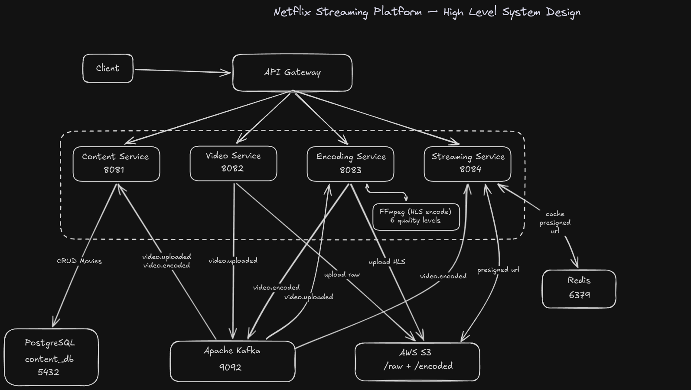

# 🎬 Netflix-Style Video Streaming Platform

> A production-grade, event-driven microservices backend that replicates core Netflix infrastructure — video upload, multi-quality FFmpeg encoding, HLS adaptive streaming, and Redis-cached presigned delivery — built with Spring Boot, Apache Kafka, AWS S3, and Redis.


---

## 📌 Overview

This project implements the core backend pipeline behind a video streaming platform. A raw video file uploaded by an admin is automatically processed through a multi-stage event-driven pipeline:

1. Raw video uploaded to **AWS S3**, event published to **Kafka**
2. **Encoding service** consumes the event, runs **FFmpeg** to produce 6 HLS quality variants (144p → 1080p), uploads encoded segments back to S3
3. **Content service** tracks status changes via Kafka events, updating the movie record through its lifecycle
4. **Streaming service** generates **presigned S3 URLs** (cached in Redis) that expire after 60 minutes, delivering secure adaptive bitrate streams to the client

No video data passes through any service at stream time — the client streams directly from S3 via presigned URLs.

---

## 🏗️ Architecture

```
┌──────────────────────────────────────────────────────────────────────────┐
│                         CLIENT / ADMIN API                               │
└──────┬───────────────────────────────────────┬───────────────────────────┘
       │  POST /api/v1/videos/upload/{movieId} │  GET /api/v1/stream/{movieId}
       ▼                                       ▼
┌─────────────────┐                   ┌─────────────────────┐
│  Video Service  │                   │  Streaming Service  │
│   port: 8082    │                   │    port: 8084       │
│                 │                   │                     │
│ Upload to S3    │                   │ Redis cache lookup  │
│ Publish Kafka   │                   │ Generate presigned  │
│ event           │                   │ S3 URLs (60 min)    │
└────────┬────────┘                   └──────────┬──────────┘
         │                                       │
         │  Kafka: video.uploaded                │  Kafka: video.encoded
         ▼                                       │
┌────────────────────────────────────────────────┴──────────────────────┐
│                        Apache Kafka (KRaft mode)                      │
│              Topics: video.uploaded  ·  video.encoded                 │
│              Partitions: 3  ·  Replication factor: 1                  │
└────────────┬──────────────────────────────────────────────────────────┘
             │
             ▼  Consumes: video.uploaded
┌────────────────────┐          ┌──────────────────────┐
│  Encoding Service  │          │   Content Service    │
│    port: 8083      │          │     port: 8081       │
│                    │          │                      │
│ Download raw from  │          │ PostgreSQL: movies   │
│ S3                 │          │ table with status    │
│ FFmpeg → 6 quality │          │ lifecycle tracking   │
│ HLS variants       │          │                      │
│ Upload segments    │          │ Consumes both Kafka  │
│ to S3              │          │ topics to sync movie │
│ Publish encoded    │          │ videoKey + hlsUrl    │
│ event              │          └──────────────────────┘
└────────────────────┘
         │
         ▼  Kafka: video.encoded
┌─────────────────────────┐
│  AWS S3 Bucket          │
│                         │
│ raw/{movieId}/uuid.mp4  │  ← raw upload
│ encoded/{movieId}/      │  ← HLS output
│   master.m3u8           │
│   1080p/playlist.m3u8   │
│   1080p/segment_001.ts  │
│   720p/playlist.m3u8    │
│   ...                   │
└─────────────────────────┘
```

---

## 📂 Project Structure

```
Netflix-Streaming/
│
├── docker-compose.yml              # Kafka (KRaft mode) container
│
├── video-service/                  # Port 8082 — upload entry point
│   └── src/main/java/com/netflix/videoservice/
│       ├── controller/VideoController.java      # POST /api/v1/videos/upload/{movieId}
│       ├── service/VideoService.java            # S3 upload + Kafka publish
│       ├── event/VideoUploadedEvent.java        # Kafka event payload
│       ├── config/KafkaConfig.java             # Topic declarations
│       └── config/S3Config.java               # AWS SDK v2 client setup
│
├── encoding-service/               # Port 8083 — FFmpeg processing
│   └── src/main/java/com/netflix/encodingservice/
│       ├── service/EncodingService.java         # Full encoding pipeline
│       ├── service/VideoUploadedEventConsumer.java  # Kafka consumer
│       ├── event/VideoUploadedEvent.java
│       └── event/VideoEncodedEvent.java
│
├── content-service/                # Port 8081 — movie catalog + status
│   └── src/main/java/com/netflix/contentservice/
│       ├── controller/ContentController.java    # CRUD + search endpoints
│       ├── service/ContentService.java          # Business logic + DB
│       ├── service/VideoUploadedEncodedEventConsumer.java  # Both topics
│       ├── model/Movie.java                     # JPA entity
│       ├── model/VideoStatus.java              # Status enum
│       └── repository/MovieRepository.java
│
└── streaming-service/              # Port 8084 — secure HLS delivery
    └── src/main/java/com/netflix/streamingservice/
        ├── controller/StreamingController.java  # Stream + playlist endpoints
        ├── service/StreamingService.java        # Presigned URL + Redis cache
        └── service/VideoEncodedEventConsumer.java  # Stores playlist key in Redis
```

---

## 🔄 Complete Video Lifecycle

### Phase 1 — Upload

```
Admin → POST /api/v1/videos/upload/{movieId}  (multipart file, up to 2GB)
         │
         ▼
VideoService.uploadVideo()
  1. Generates S3 key: raw/{movieId}/{uuid}_{filename}
  2. Streams file directly to S3 via PutObjectRequest
  3. Publishes VideoUploadedEvent to Kafka topic: video.uploaded
         │
         ├─► Content Service consumer updates movie.videoKey + status → UPLOADED
         └─► Encoding Service consumer triggers encoding pipeline
```

### Phase 2 — Encoding

```
EncodingService.encodeVideo()
  1. Downloads raw video from S3 to local temp: /tmp/encoding/{movieId}/raw_video.mp4
  2. For each of 6 quality levels:
       FFmpeg command → produces playlist.m3u8 + segment_001.ts, segment_002.ts...
  3. Generates master.m3u8 referencing all quality playlists
  4. Recursively uploads all encoded files to S3: encoded/{movieId}/
  5. Publishes VideoEncodedEvent (success=true, hlsUrl, masterPlaylistKey) to video.encoded
  6. Cleans up all temp files (always runs in finally block)

On failure:
  Publishes VideoEncodedEvent (success=false, errorMessage)
  Content Service sets movie.videoStatus → FAILED
```

### Phase 3 — Ready to Stream

```
VideoEncodedEventConsumer (streaming-service)
  Receives video.encoded event → stores in Redis:
    key: streaming:playlist:{movieId}
    value: "encoded/{movieId}/master.m3u8"

ContentService (content-service)
  Receives video.encoded event → updates:
    movie.hlsUrl = "https://{bucket}.s3.amazonaws.com/encoded/{movieId}/master.m3u8"
    movie.videoStatus = READY
```

### Phase 4 — Streaming

```
Client → GET /api/v1/stream/{movieId}
  1. Looks up master playlist key in Redis (O(1))
  2. Checks Redis cache for existing presigned URL: streaming:url:{movieId}
  3a. Cache HIT  → return cached URL immediately (sub-millisecond)
  3b. Cache MISS → generate new presigned S3 URL (expires in 60 min)
                   cache in Redis for 55 min (5 min buffer before S3 expiry)
  4. Returns StreamingResponse {movieId, streamingUrl, quality, expiredInMinutes}

Client → GET /api/v1/stream/{movieId}/playlist?path=encoded/{movieId}/1080p/playlist.m3u8
  Streaming service reads the .m3u8 file from S3, rewrites every segment reference
  to a fresh presigned URL, returns signed playlist content.
  HLS player then fetches each .ts segment directly from S3.
```

---

## 🎞️ HLS Encoding — Quality Variants

The encoding service produces 6 adaptive bitrate variants via FFmpeg:

| Quality | Resolution | Video Bitrate | Audio Bitrate | Use case |
|---|---|---|---|---|
| 1080p | 1920×1080 | 5,000 kbps | 128 kbps | Fast connection / TV |
| 720p | 1280×720 | 2,800 kbps | 128 kbps | Standard HD |
| 480p | 854×480 | 1,200 kbps | 128 kbps | Mobile / average connection |
| 360p | 640×360 | 800 kbps | 128 kbps | Slow mobile |
| 240p | 426×240 | 400 kbps | 128 kbps | Very slow connection |
| 144p | 256×144 | 150 kbps | 128 kbps | Minimum viable stream |

Each variant uses:
- **Codec:** H.264 (`libx264`) — widest device compatibility
- **Audio:** AAC — standard for HLS
- **Segment duration:** 10 seconds per `.ts` file
- **Playlist type:** full (all segments listed, `hls_list_size=0`)

The master playlist `master.m3u8` references all 6 quality playlists with their `BANDWIDTH` and `RESOLUTION` attributes, allowing HLS players to auto-select the best quality based on network conditions.

---

## 🎯 Video Status Lifecycle

```
PENDING   →  UPLOADED  →  ENCODING  →  ENCODED  →  READY
(created)    (S3 done)    (ffmpeg)     (done)       (streamable)
                                                        ↓
                                                      FAILED
                                                   (ffmpeg error)
```

---

## 🔐 Security — Presigned URLs

S3 videos are never publicly accessible. All streaming happens through AWS presigned URLs:

- Each presigned URL grants temporary read access (60 minutes) to a single S3 object
- The URL is cryptographically signed with AWS credentials — tamper-proof
- Streaming service caches presigned URLs in Redis for 55 minutes to avoid redundant signing operations
- Each `.m3u8` playlist file is dynamically rewritten by the streaming service — every segment `.ts` reference is replaced with a fresh presigned URL before being returned to the client
- This means even if someone extracts a URL, it expires within the hour

---

## 📡 API Reference

### Content Service (port 8081)

| Method | Endpoint | Description |
|---|---|---|
| `POST` | `/api/v1/movies` | Add movie to catalog (sets status: PENDING) |
| `GET` | `/api/v1/movies` | Get all movies |
| `GET` | `/api/v1/movies/{movieId}` | Get movie by ID |
| `GET` | `/api/v1/movies/genre/{genre}` | Filter by genre |
| `GET` | `/api/v1/movies/search?title=` | Search by title (case-insensitive) |

### Video Service (port 8082)

| Method | Endpoint | Description |
|---|---|---|
| `POST` | `/api/v1/videos/upload/{movieId}` | Upload raw video file (multipart, max 2GB) |

### Streaming Service (port 8084)

| Method | Endpoint | Description |
|---|---|---|
| `GET` | `/api/v1/stream/{movieId}` | Get presigned HLS streaming URL |
| `GET` | `/api/v1/stream/{movieId}/playlist?path=` | Get signed m3u8 playlist content |

---

## ⚙️ Configuration

### Environment Variables (all services)

| Variable | Description |
|---|---|
| `ACESS_KEY` | AWS access key ID |
| `SECRET_KEY` | AWS secret access key |
| `REGION` | AWS region (e.g. `ap-south-1`) |
| `BUCKET_NAME` | S3 bucket name |

### Service Ports

| Service | Port |
|---|---|
| Content Service | 8081 |
| Video Service | 8082 |
| Encoding Service | 8083 |
| Streaming Service | 8084 |
| Kafka | 9092 |
| Redis | 6379 |
| PostgreSQL | 5432 |

### Encoding Service — additional config

```properties
ffmpeg.path=ffmpeg                 # path to ffmpeg binary
encoding.base-path=/tmp/encoding   # temp directory for processing
```

### Streaming Service — cache settings

```properties
aws.s3.presigned-url-expiry=60     # minutes before S3 URL expires
# Redis TTL is set to 55 minutes (5 min safety buffer)
```

---

## 🚀 Getting Started

### Prerequisites

- Java 17+
- Maven 3.8+
- Docker and Docker Compose
- FFmpeg installed on the encoding service host
- AWS account with an S3 bucket
- PostgreSQL database (for content-service)
- Redis (for streaming-service)

### 1. Start Kafka

```bash
docker-compose up -d
```

This starts Kafka in KRaft mode (no ZooKeeper required) on port 9092.

### 2. Configure environment variables

Create a `.env` file or export:

```bash
export ACESS_KEY=your_aws_access_key
export SECRET_KEY=your_aws_secret_key
export REGION=ap-south-1
export BUCKET_NAME=your-video-bucket
```

### 3. Configure Content Service database

```properties
# content-service/src/main/resources/application.properties
spring.datasource.url=jdbc:postgresql://localhost:5432/content_db
spring.datasource.username=your_db_user
spring.datasource.password=your_db_password
```

### 4. Start each service

```bash
# Terminal 1 — content service
cd content-service && ./mvnw spring-boot:run

# Terminal 2 — video service
cd video-service && ./mvnw spring-boot:run

# Terminal 3 — encoding service
cd encoding-service && ./mvnw spring-boot:run

# Terminal 4 — streaming service
cd streaming-service && ./mvnw spring-boot:run
```

### 5. Test the pipeline

```bash
# Step 1: Add a movie to the catalog
curl -X POST http://localhost:8081/api/v1/movies \
  -H "Content-Type: application/json" \
  -d '{
    "title": "Inception",
    "description": "A mind-bending thriller",
    "genere": "SCI_FI",
    "director": "Christopher Nolan",
    "releaseYear": 2010,
    "rating": 8.8,
    "durationMinutes": 148
  }'
# Note the returned movieId

# Step 2: Upload the video file
curl -X POST http://localhost:8082/api/v1/videos/upload/{movieId} \
  -F "file=@/path/to/movie.mp4"
# Encoding starts automatically via Kafka

# Step 3: Check movie status (should progress to READY after encoding)
curl http://localhost:8081/api/v1/movies/{movieId}

# Step 4: Get streaming URL
curl http://localhost:8084/api/v1/stream/{movieId}
# Returns a presigned HLS URL — open in any HLS player (VLC, Safari, hls.js)
```

---

## 🛠️ Tech Stack

| Technology | Version | Purpose |
|---|---|---|
| Spring Boot | 4.0.6 | Microservice framework |
| Spring Kafka | — | Kafka producer/consumer integration |
| Spring Data JPA | — | PostgreSQL ORM (content-service) |
| Spring Data Redis | — | Redis cache integration (streaming-service) |
| AWS SDK v2 | 2.44.4 | S3 upload, download, presigned URLs |
| Apache Kafka | Latest (KRaft) | Event streaming between services |
| FFmpeg | System | Multi-quality HLS encoding |
| PostgreSQL | — | Movie catalog persistence |
| Redis | — | Presigned URL cache + playlist key store |
| Lombok | — | Boilerplate reduction |
| Docker Compose | — | Kafka container orchestration |

---

## 🔍 Technical Highlights

- **Event-driven decoupling** — services never call each other directly. Video Service doesn't know Encoding Service exists. They communicate only through Kafka topics. If encoding-service is down, messages queue in Kafka and are processed when it recovers.
- **Exactly-once S3 streaming at scale** — no video bytes pass through any Java service during playback. The streaming service generates a presigned URL and the client streams directly from S3. This means streaming throughput scales with S3, not with the number of service instances.
- **Redis as a two-level cache** — `streaming:playlist:{movieId}` stores the S3 key (populated by Kafka event), `streaming:url:{movieId}` caches the presigned URL for 55 minutes. Two separate concerns, single data store.
- **FFmpeg subprocess management** — encoding uses `ProcessBuilder` to spawn FFmpeg as a child process, inheriting I/O for real-time log visibility. Exit code validation catches encoding failures without reading stdout.
- **Adaptive bitrate via HLS** — the master playlist's `BANDWIDTH` and `RESOLUTION` attributes allow the client's HLS player to automatically switch quality levels mid-stream based on network conditions. No server-side logic required for quality switching.
- **Presigned URL rewriting** — the most elegant detail: when a client requests a quality-specific playlist, the streaming service rewrites every `.ts` segment reference inline with a fresh presigned URL. This means the client never needs direct S3 access credentials.
- **Resilient encoding pipeline** — every encoding job runs in a try/catch/finally. Both success and failure publish a `VideoEncodedEvent` to Kafka. Temp files are always cleaned up. Content service always gets an accurate final status.

---

## 📈 Potential Extensions

- [ ] Add an API Gateway (Spring Cloud Gateway) as a single entry point across all services
- [ ] Implement Spring Security with JWT authentication on all endpoints
- [ ] Add a progress tracking endpoint so clients can poll encoding status in real time
- [ ] Use Spring Cloud Config Server for centralized configuration management
- [ ] Deploy encoding service on a GPU-enabled EC2 instance using hardware-accelerated FFmpeg (`h264_nvenc`)
- [ ] Add a CDN (CloudFront) in front of S3 for global low-latency delivery
- [ ] Implement service discovery (Eureka) so services auto-register and find each other
- [ ] Add distributed tracing (Zipkin/Sleuth) to trace a request across all 4 services

---

## 📄 License

This project is open source and available under the [MIT License](LICENSE).

---

<p align="center">
  Built to demonstrate production-grade event-driven microservice architecture — the same patterns used by real streaming platforms at scale.
</p>
